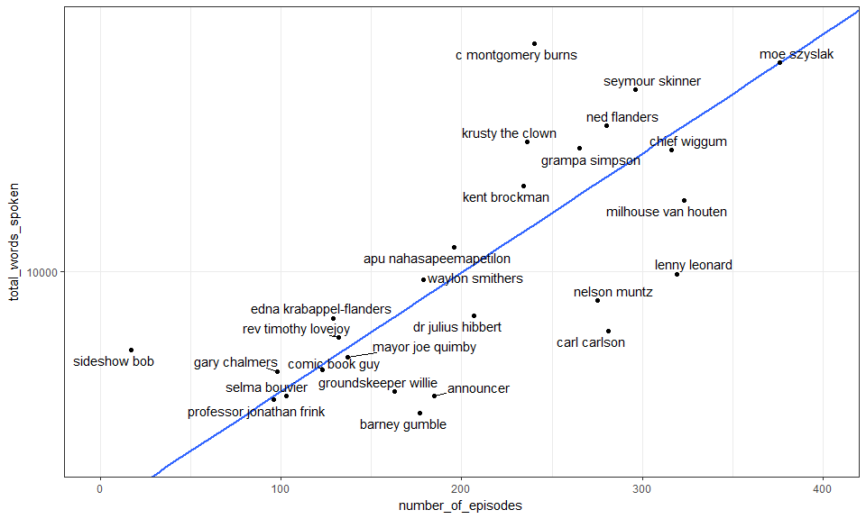

Dan's analysis of The Simpsons
================

Let's explore a dataset on The Simpsons, the [longest-running](https://en.wikipedia.org/wiki/The_Simpsons), and in my opinion best, American TV sitcom of all time. This dataset is available on Kaggle [here](https://www.kaggle.com/wcukierski/the-simpsons-by-the-data)

Import Data
===========

The dataset is composed of 4 files. Let's import them and have a look.

    ##   id             name  normalized_name gender
    ## 1  7         Children         children       
    ## 2 12 Mechanical Santa mechanical santa       
    ## 3 13       Tattoo Man       tattoo man       
    ## 4 16 DOCTOR ZITSOFSKY doctor zitsofsky       
    ## 5 20         Students         students       
    ## 6 24       Little Boy       little boy

    ##   id                          name               normalized_name
    ## 1  1                        Street                        street
    ## 2  2                           Car                           car
    ## 3  3 Springfield Elementary School springfield elementary school
    ## 4  4                    Auditorium                    auditorium
    ## 5  5                  Simpson Home                  simpson home
    ## 6  6                       KITCHEN                       kitchen

The first two data tables are simple. The first gives a code to each *character* in the series and the second gives a code to each *location*. The next table is more extensive. It contains data for each *episode* of the show, including things like air date, season, views, imdb ratings, etc.

    ##   id                                                 title
    ## 1 10                                     Homer's Night Out
    ## 2 12                                    Krusty Gets Busted
    ## 3 14                                      Bart Gets an "F"
    ## 4 17 Two Cars in Every Garage and Three Eyes on Every Fish
    ## 5 19                                  Dead Putting Society
    ## 6 21                                    Bart the Daredevil
    ##   original_air_date production_code season number_in_season
    ## 1         3/25/1990            7G10      1               10
    ## 2         4/29/1990            7G12      1               12
    ## 3        10/11/1990            7F03      2                1
    ## 4         11/1/1990            7F01      2                4
    ## 5        11/15/1990            7F08      2                6
    ## 6         12/6/1990            7F06      2                8
    ##   number_in_series us_viewers_in_millions views imdb_rating imdb_votes
    ## 1               10                   30.3 50816         7.4       1511
    ## 2               12                   30.4 62561         8.3       1716
    ## 3               14                   33.6 59575         8.2       1638
    ## 4               17                   26.1 64959         8.1       1457
    ## 5               19                   25.4 50691         8.0       1366
    ## 6               21                   26.2 57605         8.4       1522
    ##                                                                      image_url
    ## 1 http://static-media.fxx.com/img/FX_Networks_-_FXX/305/815/Simpsons_01_10.jpg
    ## 2 http://static-media.fxx.com/img/FX_Networks_-_FXX/245/843/Simpsons_01_12.jpg
    ## 3    http://static-media.fxx.com/img/FX_Networks_-_FXX/662/811/bart_gets_F.jpg
    ## 4 http://static-media.fxx.com/img/FX_Networks_-_FXX/660/859/Simpsons_02_01.jpg
    ## 5 http://static-media.fxx.com/img/FX_Networks_-_FXX/662/811/Simpsons_02_08.jpg
    ## 6 http://static-media.fxx.com/img/FX_Networks_-_FXX/662/811/Simpsons_02_06.jpg
    ##                                         video_url
    ## 1 http://www.simpsonsworld.com/video/275197507879
    ## 2 http://www.simpsonsworld.com/video/288019523914
    ## 3 http://www.simpsonsworld.com/video/260539459671
    ## 4 http://www.simpsonsworld.com/video/260537411822
    ## 5 http://www.simpsonsworld.com/video/260539459670
    ## 6 http://www.simpsonsworld.com/video/260539459702

The fourth data table is the main one. It contains the *words spoken* by each character during different episodes. The table is pretty large, containing over 158,000 rows!

    ##     id episode_id number
    ## 1 9549         32    209
    ## 2 9550         32    210
    ## 3 9551         32    211
    ## 4 9552         32    212
    ## 5 9553         32    213
    ## 6 9554         32    214
    ##                                                                                                                                                                                                  raw_text
    ## 1                                 Miss Hoover: No actually it was a little of both. Sometimes when a disease is in all the magazines and all the news shows it's only natural that you think you have it.
    ## 2                                                                                                                                                       Lisa Simpson: (NEAR TEARS) Where's Mr. Bergstrom?
    ## 3                                                                                Miss Hoover: I don't know. Although I'd sure like to talk to him. He didn't touch my lesson plan. What did he teach you?
    ## 4                                                                                                                                                                Lisa Simpson: That life is worth living.
    ## 5 Edna Krabappel-Flanders: The polls will be open from now until the end of recess. Now (SOUR) just in case any of you have decided to put any thought into this we'll have our final statements. Martin?
    ## 6                                                                                                                             Martin Prince: (HOARSE WHISPER) I don't think there's anything left to say.
    ##   timestamp_in_ms speaking_line character_id location_id
    ## 1          848000          TRUE          464           3
    ## 2          856000          TRUE            9           3
    ## 3          856000          TRUE          464           3
    ## 4          864000          TRUE            9           3
    ## 5          864000          TRUE           40           3
    ## 6          877000          TRUE           38           3
    ##        raw_character_text             raw_location_text
    ## 1             Miss Hoover Springfield Elementary School
    ## 2            Lisa Simpson Springfield Elementary School
    ## 3             Miss Hoover Springfield Elementary School
    ## 4            Lisa Simpson Springfield Elementary School
    ## 5 Edna Krabappel-Flanders Springfield Elementary School
    ## 6           Martin Prince Springfield Elementary School
    ##                                                                                                                                                              spoken_words
    ## 1              No actually it was a little of both. Sometimes when a disease is in all the magazines and all the news shows it's only natural that you think you have it.
    ## 2                                                                                                                                                  Where's Mr. Bergstrom?
    ## 3                                                             I don't know. Although I'd sure like to talk to him. He didn't touch my lesson plan. What did he teach you?
    ## 4                                                                                                                                              That life is worth living.
    ## 5 The polls will be open from now until the end of recess. Now just in case any of you have decided to put any thought into this we'll have our final statements. Martin?
    ## 6                                                                                                                             I don't think there's anything left to say.
    ##                                                                                                                                                       normalized_text
    ## 1             no actually it was a little of both sometimes when a disease is in all the magazines and all the news shows its only natural that you think you have it
    ## 2                                                                                                                                                 wheres mr bergstrom
    ## 3                                                                i dont know although id sure like to talk to him he didnt touch my lesson plan what did he teach you
    ## 4                                                                                                                                           that life is worth living
    ## 5 the polls will be open from now until the end of recess now just in case any of you have decided to put any thought into this well have our final statements martin
    ## 6                                                                                                                            i dont think theres anything left to say
    ##   word_count
    ## 1         31
    ## 2          3
    ## 3         22
    ## 4          5
    ## 5         33
    ## 6          8

    ## [1] 158271     13

Wrangle Data
============

We need to wrangle these four data frames into a tidy format for analysis. We'll start by picking the columns we need from each dataset. Here's a simplified *episodes* table.

    ##   id                                                 title
    ## 1 10                                     Homer's Night Out
    ## 2 12                                    Krusty Gets Busted
    ## 3 14                                      Bart Gets an "F"
    ## 4 17 Two Cars in Every Garage and Three Eyes on Every Fish
    ## 5 19                                  Dead Putting Society
    ## 6 21                                    Bart the Daredevil
    ##   original_air_date season number_in_season number_in_series
    ## 1         3/25/1990      1               10               10
    ## 2         4/29/1990      1               12               12
    ## 3        10/11/1990      2                1               14
    ## 4         11/1/1990      2                4               17
    ## 5        11/15/1990      2                6               19
    ## 6         12/6/1990      2                8               21
    ##   us_viewers_in_millions views imdb_rating imdb_votes
    ## 1                   30.3 50816         7.4       1511
    ## 2                   30.4 62561         8.3       1716
    ## 3                   33.6 59575         8.2       1638
    ## 4                   26.1 64959         8.1       1457
    ## 5                   25.4 50691         8.0       1366
    ## 6                   26.2 57605         8.4       1522

Next, let's check the class of each column in the data tables to make sure they were imported correctly.

    ##              id normalized_name          gender 
    ##       "integer"     "character"     "character"

    ##              id normalized_name 
    ##       "integer"     "character"

The *character* and *location* data tables look reasonable. Both character and location names are recognized as character vectors for example.

    ##                     id                  title      original_air_date 
    ##              "integer"            "character"            "character" 
    ##                 season       number_in_season       number_in_series 
    ##              "integer"              "integer"              "integer" 
    ## us_viewers_in_millions                  views            imdb_rating 
    ##              "numeric"              "integer"              "numeric" 
    ##             imdb_votes 
    ##              "integer"

We can spot a problem in the *episodes* data frame though. Air date was recognized as a character vector and not a date. We can use functions in the **lubridate** package to convert the variable into a date and then extract some useful variables like the year and month the episode first aired.

    ##   original_air_date air_month air_year
    ## 1        1990-03-25         3     1990
    ## 2        1990-04-29         4     1990
    ## 3        1990-10-11        10     1990
    ## 4        1990-11-01        11     1990
    ## 5        1990-11-15        11     1990
    ## 6        1990-12-06        12     1990

Let's turn our attention to the variables in the main table with the *script* data.

    ##              id      episode_id          number   speaking_line 
    ##       "integer"       "integer"       "integer"     "character" 
    ##    character_id     location_id normalized_text      word_count 
    ##     "character"       "integer"     "character"     "character"

One obvious problem is that the 'word\_count' variable is a character when it should be an integer. We can examine the rows where 'word count' does not start with a digit.

    ##        id episode_id number speaking_line character_id location_id
    ## 1   17667         59     87          TRUE          276         636
    ## 2   81724        282    279          TRUE         3510        2370
    ## 3   91095        315    284          TRUE            2           5
    ## 4   96708        335    274          TRUE           10          53
    ## 5  125627        445    216          TRUE           17          15
    ## 6  127763        454    146          TRUE            1         248
    ## 7  140906        503    142          TRUE            2          10
    ## 8    4268         14    260          TRUE          242         212
    ## 9    4260         14    252          TRUE          241         211
    ## 10   5345         18    199          TRUE          297         239
    ## 11   5348         18    202          TRUE          297         239
    ## 12   5351         18    205          TRUE          297         239
    ## 13   5354         18    208          TRUE          297         239
    ## 14   5358         18    212          TRUE          297         239
    ## 15   8152         28     13          TRUE          187         332
    ##      normalized_text
    ## 1             455000
    ## 2            1075000
    ## 3            1220000
    ## 4       blow me down
    ## 5            1095000
    ## 6   a little schmear
    ## 7          THEN:) Uh
    ## 8    the humiliation
    ## 9            1134000
    ## 10            997000
    ## 11           1004000
    ## 12           1009000
    ## 13           1019000
    ## 14              well
    ## 15            125000
    ##                                                                         word_count
    ## 1                                                                             TRUE
    ## 2                                                                             TRUE
    ## 3                                                                             TRUE
    ## 4                                                                    I'm a Selma."
    ## 5                                                                             TRUE
    ## 6   and presto -- you're part of the under-clown railroad! So you got any talent?"
    ## 7                                  just don't ask me to drive you to the airport."
    ## 8                           the fact that it wasn't me. I've never felt so alive."
    ## 9                                                                             TRUE
    ## 10                                                                            TRUE
    ## 11                                                                            TRUE
    ## 12                                                                            TRUE
    ## 13                                                                            TRUE
    ## 14                                                                   we're all out
    ## 15                                                                            TRUE

Yikes! Some entries have logicals whereas a few others have text. This looks like a problem with parsing the dataset when it was imported. In fact, this seems to be a known issue with the dataset: <https://www.kaggle.com/forums/f/1600/the-simpsons-by-the-data/t/24334/import-problem>. Fortunately, only 15 of 158,000 rows are affected. Instead of expending energy diagnosing this problem and correcting the offending character strings, we will simply remove the suspicious rows and convert the variable into a numeric vector.

    ##              id      episode_id          number   speaking_line 
    ##       "integer"       "integer"       "integer"     "character" 
    ##    character_id     location_id normalized_text      word_count 
    ##     "character"       "integer"     "character"       "numeric"

We subsetted the data to only include rows where 'word\_count' starts with a digit. This actually removes many rows from the data, down to 132,000 from 158,000. The reason for this is that all non-speaking rows were removed, such as rows denoting a location onscreen while no one was speaking.

    ## [1] 132097      8

    ## 
    ##   TRUE 
    ## 132097

Before simplifying further, let's make a histogram of word\_count.

Another problem! Almost all the values are small (a few words per speaking line), but the long x-axis suggests there must also be some extremely big values. It is extremely unlikely that one character had a dialog hundreds of thousands of words long, so presumably these are mistakes attributable to the parsing problems. Let's look at the subset of cases with more than 1000 words.

    ##       id episode_id number speaking_line character_id location_id
    ## 1  62483        220    100          TRUE         2739        1902
    ## 2  69807        243    292          TRUE            1         422
    ## 3  83465        289    164          TRUE         3592        2425
    ## 4  87170        302     13          TRUE            9           5
    ## 5  88907        308     85          TRUE            2          15
    ## 6 111237        390     16          TRUE            9           6
    ## 7   4263         14    255          TRUE          241         211
    ## 8   5432         19      5          TRUE            8           5
    ##                                                                                                                                                                                normalized_text
    ## 1                                                                                                                                                        Dad. He wants you to blow your horn."
    ## 2                                                                                                                                                                                       crap!"
    ## 3                                                                                                                                                                          'Banana Tree'..."""
    ## 4                                                                                                                                                                                   Mad libs!"
    ## 5                                                                                                                                     the popular singer slash songwriter slash puzzle piece."
    ## 6                                                                                                                   is it wrong for me to appropriate the culture of a long-suffering people?"
    ## 7  WITH HEART) ""Chapter Six: Four Days in Philadelphia. The first Continental Congress faced a difficult job. Could the delegates agree on recommendations that all Americans could support?"
    ## 8                                                                                                                         neighbor! The Lord's certainly given us a beautiful day today. Huh?"
    ##   word_count
    ## 1     571000
    ## 2    1145000
    ## 3     672000
    ## 4     147000
    ## 5     409000
    ## 6     117000
    ## 7    1154000
    ## 8     108000

Eight cases come up. These are clearly mistakes, because the text has fewer words than is recorded in the word count variable. The very large values are likely 'id' values that slipped into the word count variable due to the parsing problems. Let's remove these values and remake our histogram.

That looks better! The distribution is positively skewed. Most spoken parts are just a few words long, but there are some longer dialogs. We can zoom in on the tail of the distribution and see that it follows the same pattern.

This is looking good, but we want to make sure we have removed all the data that had parsing issues. One quality check is to re-calculate word count from the text variable and see if it matches up with the original value given in the word count variable. When we look at a few values for our recalculated word count, it looks like it matches the original word count data exactly. This suggests the spoken text variable and the word count variable are aligned correctly.

    ##    word_count words_recalc
    ## 1          31           31
    ## 2           3            3
    ## 3          22           22
    ## 4           5            5
    ## 5          33           33
    ## 6           8            8
    ## 7           1            1
    ## 8           5            5
    ## 9           4            4
    ## 10         19           19

However, when we plot the original and the recalculated word counts, we see some cases along the bottom of the y-axis where there is divergence.

46 values have this problem, and when we look at them we see that the text is missing.

    ##    episode_id character_id normalized_text word_count words_recalc
    ## 1          36            2          #NAME?          6            1
    ## 2          40           15          #NAME?          6            1
    ## 3          95           31          #NAME?         24            1
    ## 4         119            2          #NAME?          5            1
    ## 5         128           14          #NAME?         11            1
    ## 6         139            1          #NAME?          4            1
    ## 7         144            9          #NAME?         35            1
    ## 8         144          240          #NAME?          4            1
    ## 9         145           15          #NAME?         23            1
    ## 10        148            1          #NAME?          2            1
    ## 11        148         1941          #NAME?         36            1
    ## 12        150            8          #NAME?          8            1
    ## 13        157            2          #NAME?         13            1
    ## 14        163          211          #NAME?         14            1
    ## 15        179         2285          #NAME?          4            1
    ## 16        179         2285          #NAME?          2            1
    ## 17        249          332          #NAME?         20            1
    ## 18        286          139          #NAME?          8            1
    ## 19        315          211          #NAME?          5            1
    ## 20        341            2          #NAME?         25            1
    ## 21        360            8          #NAME?          3            1
    ## 22        369           17          #NAME?          7            1
    ## 23        399           38          #NAME?         11            1
    ## 24        443         3503          #NAME?         34            1
    ## 25        463         5641          #NAME?         10            1
    ## 26        470           15          #NAME?          8            1
    ## 27        519          170          #NAME?         11            1
    ## 28        524            9          #NAME?         11            1
    ## 29        527           17          #NAME?         14            1
    ## 30        558         6654          #NAME?          6            1
    ## 31        563            2          #NAME?         24            1
    ## 32        568            9          #NAME?         12            1
    ## 33        146          335          #NAME?          8            1
    ## 34        521           25          #NAME?          3            1
    ## 35          1            2          #NAME?          3            1
    ## 36          1            1          #NAME?          4            1
    ## 37         12          220          #NAME?          4            1
    ## 38         12          219          #NAME?          4            1
    ## 39         16            2          #NAME?         12            1
    ## 40         16            2          #NAME?         40            1
    ## 41         16            2          #NAME?         30            1
    ## 42         16            2          #NAME?         33            1
    ## 43         17           15          #NAME?         25            1
    ## 44         25            2          #NAME?         16            1
    ## 45         25            1          #NAME?          6            1
    ## 46         32            9          #NAME?         21            1

Again, let's remove them. It is worth noticing that these problematic cases are from different episodes and involve different characters. So by removing these cases we are presumably not unintentionally introducing bias into the data.

Now that we are more confident in the quality of our main data, we can reduce the size of this data frame. I think a logical approach is to calculate the number of words spoken by each character in each episode. When we do that the data looks like this:

    ## # A tibble: 6 x 3
    ## # Groups:   episode_id [1]
    ##   episode_id character_id words_in_episode
    ##        <int>        <chr>            <dbl>
    ## 1          1            1              369
    ## 2          1           10              113
    ## 3          1           11               56
    ## 4          1           12               24
    ## 5          1           13               11
    ## 6          1           14               18

Next we want to add the data from the *character* and *episode* tables into this data frame (we'll leave out the *location* data for now). Let's start by adding character names to the data.

    ##    episode_id character_id words_in_episode  normalized_name gender
    ## 71          1            1              369    marge simpson      f
    ## 86          1           10              113    patty bouvier      f
    ## 76          1           11               56     ned flanders      m
    ## 2           1           12               24 mechanical santa       
    ## 3           1           13               11       tattoo man       
    ## 80          1           14               18  waylon smithers      m

Then we can add in the episode data.

    ##   episode_id character_id words_in_episode  normalized_name gender
    ## 1          1            1              369    marge simpson      f
    ## 2          1           10              113    patty bouvier      f
    ## 3          1           11               56     ned flanders      m
    ## 4          1           12               24 mechanical santa       
    ## 5          1           13               11       tattoo man       
    ## 6          1           14               18  waylon smithers      m
    ##                               title original_air_date season
    ## 1 Simpsons Roasting on an Open Fire        1989-12-17      1
    ## 2 Simpsons Roasting on an Open Fire        1989-12-17      1
    ## 3 Simpsons Roasting on an Open Fire        1989-12-17      1
    ## 4 Simpsons Roasting on an Open Fire        1989-12-17      1
    ## 5 Simpsons Roasting on an Open Fire        1989-12-17      1
    ## 6 Simpsons Roasting on an Open Fire        1989-12-17      1
    ##   number_in_season number_in_series us_viewers_in_millions  views
    ## 1                1                1                   26.7 171408
    ## 2                1                1                   26.7 171408
    ## 3                1                1                   26.7 171408
    ## 4                1                1                   26.7 171408
    ## 5                1                1                   26.7 171408
    ## 6                1                1                   26.7 171408
    ##   imdb_rating imdb_votes air_year air_month
    ## 1         8.2       3734     1989        12
    ## 2         8.2       3734     1989        12
    ## 3         8.2       3734     1989        12
    ## 4         8.2       3734     1989        12
    ## 5         8.2       3734     1989        12
    ## 6         8.2       3734     1989        12

This looks like a tidy dataset we can work with!

Who speaks the most?
====================

Now we can ask questions with the data, and we will start with a simple one: who has spoken the most in the series? To start, we can look at the distribution of our words per episode variable.

    ##    Min. 1st Qu.  Median    Mean 3rd Qu.    Max. 
    ##    0.00    8.00   19.00   65.31   56.00 1387.00

Most characters have just a few lines per episode whereas others have many lines. The median is just 19 words per episode, but the max is over 1000. This make sense. The core protagonists in any given episode are likely to have many lines whereas peripheral characters may only have a few lines.

To get a better feel for this, let's take 10 random characters and plot how much they speak per episode.

Even as a fan of the show, I have no idea who most of these characters are! Except for Metallica guitarist Kirk Hammett starring as himself...

Let's make a simple table of how many episodes each character appears in, and then plot the results.

Again a peculiar looking distribution! Most characters occur in very few episodes. When we zoom in on the distribution around 1, we see that over 5000 of the ~6700 characters in the data appear just once.

We can also look at the other side of the distribution, like the characters that occur in more than 50 episodes. The distribution looks a little discontinuous. There is a group of characters that occur in almost 600 episodes.

As could be expected, this is the Simpsons nuclear family (Homer, Marge, Bart, and Lisa).

    ## 
    ## homer simpson marge simpson  bart simpson  lisa simpson 
    ##           564           563           562           562

To get an idea of the variation in speaking roles per episode, let's plot the words spoken per episode for the 10 characters occurring in the most episodes

The character-specific distributions also seem right-skewed. There are a few episodes for each character where they speak more than normal. A boxplot is a better way to visualize this.

We should keep this skewed-distribution in mind in case we want to do any modeling in the future. A log transformation might be needed. We can also see in this plot that the Simpson family has more dialog than other characters.

So to come back to our question: who speaks the most? After exploring the episode-level data, we can expect that the Simpson family will dominate. Let's calculate the total number of words spoken by each character. We'll limit ourselves to the top 20 characters, because there are a lot of uninteresting minor characters in the dataset.

    ##       name                      prop_total_words
    ##  [1,] "homer simpson"           "0.2096"        
    ##  [2,] "marge simpson"           "0.0963"        
    ##  [3,] "bart simpson"            "0.0849"        
    ##  [4,] "lisa simpson"            "0.077"         
    ##  [5,] "c montgomery burns"      "0.028"         
    ##  [6,] "moe szyslak"             "0.0252"        
    ##  [7,] "seymour skinner"         "0.0216"        
    ##  [8,] "ned flanders"            "0.0175"        
    ##  [9,] "krusty the clown"        "0.016"         
    ## [10,] "grampa simpson"          "0.0154"        
    ## [11,] "chief wiggum"            "0.0153"        
    ## [12,] "kent brockman"           "0.0125"        
    ## [13,] "milhouse van houten"     "0.0115"        
    ## [14,] "apu nahasapeemapetilon"  "0.0088"        
    ## [15,] "lenny leonard"           "0.0075"        
    ## [16,] "waylon smithers"         "0.0073"        
    ## [17,] "nelson muntz"            "0.0065"        
    ## [18,] "dr julius hibbert"       "0.0059"        
    ## [19,] "edna krabappel-flanders" "0.0059"        
    ## [20,] "carl carlson"            "0.0055"

Homer has by far the most dialog followed by Marge, Bart, and Lisa. Of all the words spoken in the series, 21% have come from Homer. Together the Simpson family has spoken 47% of all words. After reading through the characters, it is clear that most are male. Let's add this element to the plot.

Only three of the top 20 characters are female! Two of those are Marge and Lisa. The only non-Simpson woman with a large number of speaking lines is Bart's teacher, Ms. Krabappel.

The most verbose non-Simpson is Mr. Burns, which is a little surprising, because he was not in the top 10 when we calculated the number of episodes each character appears in. We can check if some characters have a lot of speaking lines relative to the number of episodes they appear in. We willl limit ourselves to the top 30 characters.

This is a little hard to read, because the character names overlap each other. Homer's dominance is still obvious, as he speaks more than we would expect, given the number of episodes he appears in. We can also see that Mr. Burns must talk a lot in the episodes he appears in. We can make this easier to read by zooming in on the show's secondary characters. 

There are some interesting outliers. Mr. Burns must have relatively long dialogs. Sideshow Bob, a recurrent guest star, occurs in just a few episodes, but is clearly very important in those episodes. Some characters occur in a lot of episodes, but don't have much to say. For example, Lenny, Carl, and Barney (Homer's bar buddies) have little dialog relative to the number of episodes they appear in.

Has character makeup changed over time?
=======================================

So Homer has dominated dialog in the series, but has this always been the case? Let's see how speaking has changed over time for the ten characters with the most speaking parts.

It is hard to discern much from this plot other than Homer having the most dialog over the entire series. Maybe differences at the lower end of the spectrum will become clearer when we log transform the y-axis. We can also plot Simpsons and non-Simpsons separately. 

Now we can see that the screen time of some characters has changed. Bart looks like he was more important at the beginning of the series. The same can be said for Mr. Burns. Moe the bartender, by contrast, spoke less in early episodes. Instead of looking at differences between specific characters, we can just plot how the number of words spoken per character changes over the series. We'll do this for the top 30 characters (the plot looks similar if we chose a different number of characters).

There is a noticeable decrease during the first few seasons. The Simpsons universe has expanded over the 20+ years of the series. If the number of characters increases, and there are more characters appearing per episode, then the time available for each character to speak has to decrease. When we plot the number of characters that speak per episode, then we see that it increases during the first few seasons.

So in the early years of the series, the dialog per episode for characters decreased, while at the same time the number of characters appearing in each episode increased. This dynamic suggests that different characters will compete with each other for screen time. At some level, this is inevitable, because an episode is only so long. We can examine if certain characters seem to compete for dialog. We have to rearrange the data so that each character is a column and each row is an episode, like this.

    ##   episode_id bart_simpson homer_simpson lisa_simpson marge_simpson
    ## 1          1          335           897          222           369
    ## 2          2          619           543           71           173
    ## 3          3          209           852           54           137
    ## 4          4          189           868          150           326
    ## 5          5          795           382          224           140
    ## 6          6          400           586          339           394

For simplicity, we'll only focus on the core Simpson family. Here's a correlation matrix showing how the 4 members of the Simpson family compete (or not) for dialog in each episode.

Two numbers attracted my attention. First, the correlation coefficient for Marge and Homer was positive (0.22), so Homer-heavy episodes are also Marge-heavy episodes. That's noteworthy because we expect negative correlations; the more one character talks, the less time other characters have to talk. The relationship between Bart and Homer, though, was negative (-0.32), so episodes tend to be either Bart-heavy or Homer-heavy, but not both.

We can test this with a multiple regression model.

    ## 
    ## Call:
    ## lm(formula = homer_simpson ~ marge_simpson + bart_simpson + lisa_simpson, 
    ##     data = episode_by_character_long)
    ## 
    ## Residuals:
    ##     Min      1Q  Median      3Q     Max 
    ## -543.87 -163.39  -28.22  142.74  842.57 
    ## 
    ## Coefficients:
    ##                Estimate Std. Error t value Pr(>|t|)    
    ## (Intercept)   547.92830   26.26449  20.862  < 2e-16 ***
    ## marge_simpson   0.33228    0.07130   4.660 3.96e-06 ***
    ## bart_simpson   -0.43931    0.06092  -7.212 1.82e-12 ***
    ## lisa_simpson   -0.27517    0.06891  -3.993 7.39e-05 ***
    ## ---
    ## Signif. codes:  0 '***' 0.001 '**' 0.01 '*' 0.05 '.' 0.1 ' ' 1
    ## 
    ## Residual standard error: 231.6 on 555 degrees of freedom
    ##   (5 observations deleted due to missingness)
    ## Multiple R-squared:  0.1625, Adjusted R-squared:  0.158 
    ## F-statistic: 35.91 on 3 and 555 DF,  p-value: < 2.2e-16

The significant regression coefficients (positive for Marge, negative for Bart and Lisa) provides support for the idea that Homer often shares the screen with his wife but not with his kids.

Who dominates in 'classic' episodes?
====================================

Any Simpsons fan knows that the quality of the show has not remained constant. This can be seen in IMDB ratings.

    ## post-2000  pre-2000 
    ##  6.939503  8.074043

In the late 90's the typical rating for an episode started decreasing. In the 90s the average user rating was 8.0, but post-2000 the average episode rating was 6.9. Here's a list of some of those 90s classics (rating of 9 and up).

    ##                                     title imdb_rating
    ## 1                     You Only Move Twice         9.2
    ## 2                           Homer's Enemy         9.2
    ## 3  The City of New York vs. Homer Simpson         9.1
    ## 4          Who Shot Mr. Burns? (Part One)         9.1
    ## 5                   The Springfield Files         9.0
    ## 6                  Marge vs. the Monorail         9.0
    ## 7                Last Exit to Springfield         9.0
    ## 8                         King-Size Homer         9.0
    ## 9                            Homer Badman         9.0
    ## 10                      Homer the Heretic         9.0
    ## 11                             Cape Feare         9.0
    ## 12                  Treehouse of Horror V         9.0

IMDB ratings are based on user ratings, and some episodes have more user votes than others. Also, there is a positive correlation between user votes and user ratings.

    ## 
    ##  Pearson's product-moment correlation
    ## 
    ## data:  imdb_votes and imdb_rating
    ## t = 30.79, df = 595, p-value < 2.2e-16
    ## alternative hypothesis: true correlation is not equal to 0
    ## 95 percent confidence interval:
    ##  0.7508090 0.8129419
    ## sample estimates:
    ##       cor 
    ## 0.7838295

This correlation (0.78) is probably not cause for too much concern. It makes sense that people are more likely to rate episodes they like. However, because fewer people have expressed an opinion about lower rated episodes, the accuracy of these ratings might also be lower, which is something to keep in mind.

Let's see if any of the Simpsons family tends to have more dialog in highly-rated episodes.

It looks like Bart and Lisa speak less in the highest-rated episodes. Homer might speak more. Let's concentrate on the classic episodes. We'll call the most highly rated 5% of episodes classics and compare them to the rest of the series.

    ## 
    ## non-classic     classic 
    ##         566          30

There are 30 classic episodes. Now let's compare the amount of dialog each character had in classic episodes to that in lower-rated episodes.

Of the 4 Simpsons, the only one that has more dialog in classic vs non-classic episodes is Homer. However, there is a lot of variation and the difference is not that big. Maybe we can remove some of the variation when we look at relative dialog, i.e. the number of words spoken by a character as a proportion of the total words spoken in the episode.

Using a relative measure of dialog does not change the plot much. Homer might be more prominent in classic episodes, relative to other Simpson family members, but not by a lot.

We can fit a logistic regression to see if classic episodes differ in their character makeup than non-classics.

    ## 
    ## Call:
    ## glm(formula = classic_dummy ~ homer_simpson + marge_simpson + 
    ##     bart_simpson + lisa_simpson, family = "binomial", data = logreg_data)
    ## 
    ## Deviance Residuals: 
    ##     Min       1Q   Median       3Q      Max  
    ## -0.7118  -0.3878  -0.2717  -0.1761   2.8317  
    ## 
    ## Coefficients:
    ##               Estimate Std. Error z value Pr(>|z|)  
    ## (Intercept)    -1.3794     0.6504  -2.121   0.0339 *
    ## homer_simpson   2.0147     1.8250   1.104   0.2696  
    ## marge_simpson -10.5654     4.2891  -2.463   0.0138 *
    ## bart_simpson   -3.9253     3.4732  -1.130   0.2584  
    ## lisa_simpson  -12.0735     5.1474  -2.346   0.0190 *
    ## ---
    ## Signif. codes:  0 '***' 0.001 '**' 0.01 '*' 0.05 '.' 0.1 ' ' 1
    ## 
    ## (Dispersion parameter for binomial family taken to be 1)
    ## 
    ##     Null deviance: 233.75  on 557  degrees of freedom
    ## Residual deviance: 213.57  on 553  degrees of freedom
    ##   (5 observations deleted due to missingness)
    ## AIC: 223.57
    ## 
    ## Number of Fisher Scoring iterations: 6

Two of the four regression coefficients are significant and they suggest that classic episodes are less likely to feature Lisa and Marge (sorry ladies). The coefficient for Bart is also negative. The only positive coefficient is for Homer, though it is not statistically significant. Homer averages 21% of the dialog in non-classic episodes versus 24% in classic episodes. The rest of the Simpson family combined (Marge, Bart, and Lisa) averages 26% of the dialog in non-classic episodes versus only 19% in classic episodes.

    ## non-classic     classic 
    ##   0.2078973   0.2385889

    ## non-classic     classic 
    ##   0.2648689   0.1864550

When we color data points on the IMDB ratings vs time plot, it is clear that all the classic episodes occured in the 90's during the series' 'Golden Age'. So what makes a classic episode might have more to do with 'zeitgeist' than how much screen time each character gets.

------------------------------------------------------------------------

Final Plots and Summary
=======================

### Plot One

### Description One

The number of words spoken during the entire Simpsons series by the by 20 characters with the most dialog. Homer, by far, has had the most dialog (21% of the total), followed by the other core members of the Simpson family. Only three out of the top 20 characters are females.

### Plot Two

### Description Two

Do characters share the screen or compete for lines? Episodes that have a lot of Homer dialog also have more Marge dialog, suggesting they tend to share the screen (Pearson correlation = 0.22). By contrast, Homer-heavy episodes are not likely to be Bart-heavy episodes and vice versa (Pearson correlation = -0.32).

### Plot Three

### Description Three

What makes a classic episode? I considered classic episodes those with IMDB ratings in the top 5%. These classic episodes tend to feature slightly more Homer and slightly less Lisa, Bart, and Marge. Homer's share of the dialog is 24% in classic episodes versus 21% in a typical episode. By contrast, the rest of the Simpson family goes from 26% of the dialog in a normal episode down to 19% in a classic episode.

------------------------------------------------------------------------

Reflection
==========

The Simpsons is the longest-running American sitcom ever, and with this dataset I have explored what has made it successful. The simple answer: Homer. Homer, the family patriarch, has had vastly more speaking lines than any other character. He is also the only member of the Simpson family that has had relatively more speaking lines in the mostly highly rated episodes. Homer has remained the main protagonist even as the quality of the series has declined, suggesting the mid 90's success of The Simpsons had more to do with 'zeitgeist' than with character composition.

Wrangling this data was not straightforward. The main problem was that the variables containing the script caused parsing errors upon import. Happily, this did not affect a huge number of rows, but this should eventually be corrected.

I focused mostly on the core Simpson family. However, it would be interesting to look more closely at secondary characters. I found that some characters tend to have longer or shorter dialogs when they appear in episodes. Also, which of these secondary characters occur in the same episodes? Do they compete with each other for screen time? It would also be fun to go beyond word counts and look at the types of words spoken by each character. Homer has a well-known catchphrase, d'oh!. Could we come up with a way to identify the catchphrase of other characters?
